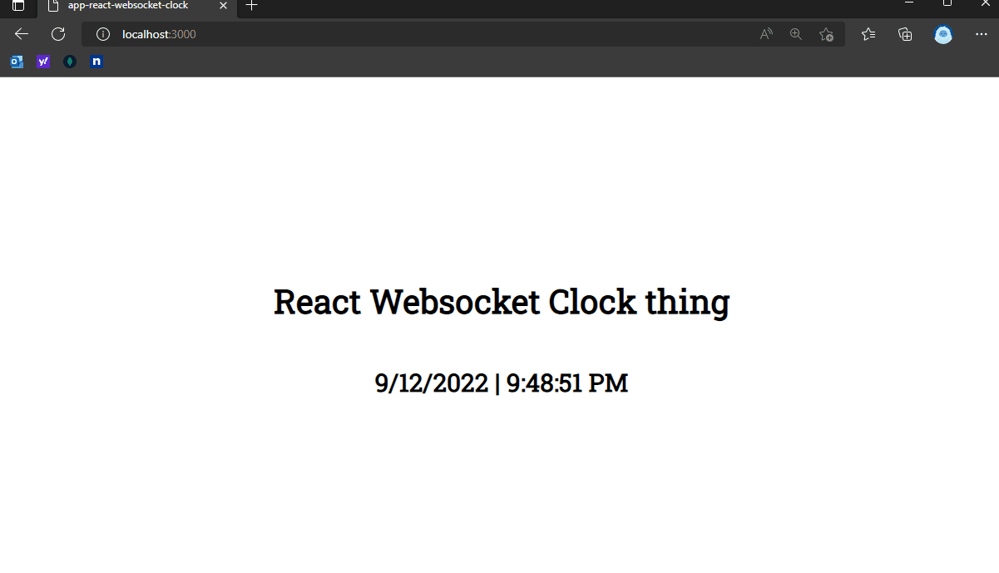

# react-websocket-clock

### Summary

The purpose of this project is to utilize websocket protocol and provide real-time communication between client and server to implement a simple clock.

### Technologies

- React
- Node
- TypeScript
- Nodemon / ts-node
- [ws - npm](https://www.npmjs.com/package/ws)

### Running the project

```shell
cd src/api
npm i
npm start

cd src/app
npm i
npm start
```

### Demo

<div>
  
</div>
